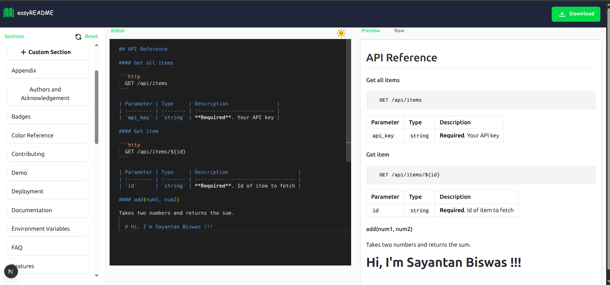

# 📝 easyREADME

**easyREADME** is a simple, modern, and intuitive web app to help developers create beautiful and customizable `README.md` files for their projects — with support for live preview, markdown editing, drag-and-drop sections, and multilingual UI.

---

## 🌟 Features

- ⚙️ **Live Markdown Editor** with syntax highlighting
- 🔍 **Live Preview** with GitHub-style markdown rendering
- 🧩 **Drag-and-drop Section Builder**
- 🌐 **Multilingual Support** (English, Hindi)
- 🌙 **Dark Mode / Light Mode Toggle**
- 🛠️ **Custom Section Creation**
- 💾 **LocalStorage Backup** for persistence
- 🚀 **Responsive Design** (Mobile & Desktop)
- 🖼️ **Instant Raw Preview Output**
- 📦 Built using **Next.js**, **Tailwind CSS**, **dnd-kit**, and **React Markdown**

---

## 📸 Screenshots

| Editor Page 
|-------------
| 

---

## 🧑‍💻 Tech Stack

- **Framework:** Next.js
- **Styling:** Tailwind CSS
- **Drag & Drop:** `@dnd-kit`
- **Markdown Parser:** `react-markdown`, `remark-gfm`
- **Localization:** `next-i18next`

---

## 🚀 Getting Started

Follow these steps to set up and run the project locally:

### 📦 Install Dependencies

Make sure you have Node.js (v18+) and npm installed.

```bash
npm install
```

### ⚙️ Development Server

To run the development server locally:

```bash
npm run dev
```

This will start the app on [http://localhost:3000](http://localhost:3000).


### 🤝 Contributing

Contributions are welcome! Feel free to fork the repository and create a pull request.

## 📄 License

This project is licensed under the MIT License.

## 💡 Author

Made with ❤️ by [Sayantan Biswas](https://in.linkedin.com/in/sayantan-biswas-352a8a27b)


